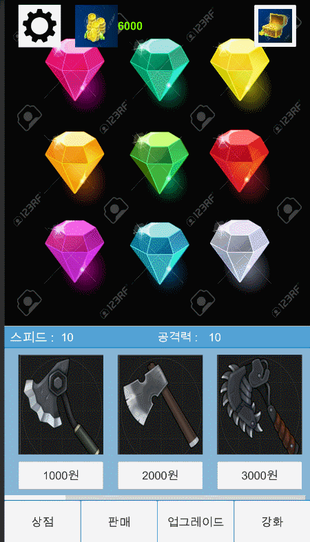

# JewelGame
**Unity를 이용한 보석방치형 게임**

안녕하세요!  
Unity를 이용하여 만든 보석방치형게임입니다.  

***
***JewelGame 디자인 소개*** / ***Introduction to JewelGame Design***

***
**기능소개**
<ul>1. 보석을 모으는 재미 
평소에 보석을 좋아하셨던 분들을 위한 게임입니다. 
</ul>

<ul>2. 상점에서 아이템을 구입하여 키우는 재미 
상점에 준비된 다양한 아이템을 구입하여 더 많은 보석을 캐보세요! 
 </ul>

<ul>3. 판매 기능 
구입했던 아이템중에 필요없는 아이템은 팔아서 돈을 얻을 수 있습니다.
 </ul>

<ul>4. 인벤토리 
인벤토리에서 내가 얻은 아이템들을 확인하실 수 있습니다  
</ul>

<ul>5. 보석 클릭시 돈을 얻는 기능 
보석 클릭시 돈이 오르며 보유한 돈으로 아이템을 구입하실 수 있습니다.
 </ul>
***

#### JewelGame을 해보세요!

***

궁금한 점 및 요청사항은 아래 이메일을 참고해주세요 
구글 이메일 tnwls9721@gmil.com 
네이버 이메일 chfhrtorthsk@naver.com 

***
## Engilsh
# JewelGame
**Jewel-proof game using Unity**

Hello!  
This is a jewel-proof game made using Unity.

**Feature introduction**

<ul>1. the fun of collecting jewels  
This game is for those who like jewelry. 
</ul>

<ul>2. The fun of buying and growing items in stores  
Buy a variety of items prepared at the store to find more jewelry! 
</ul>

<ul>3. Sales Functions  
You can get money by selling items that you don't need. 
</ul>

<ul>4. Inventory   
You can check the items I got in the inventory.  
</ul>

<ul>5. The ability to get money by clicking on jewelry  
When you click on jewelry, you can purchase items with the money you have.  
</ul>

***

#### Try JewellGame!

***

Please refer to the email below for questions and requests. 
Google Email tnwls9721@gmil.com 
Naver E-mail chfhrtorthsk@naver.com 
